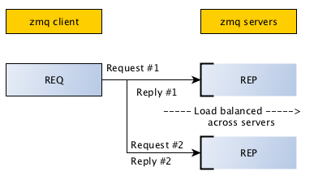
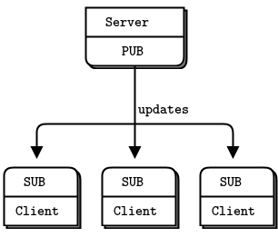
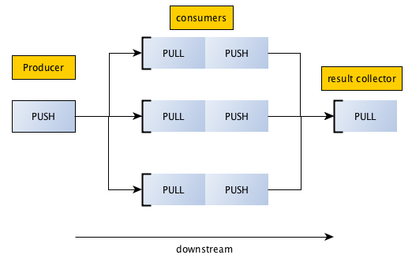
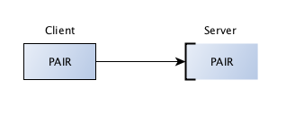
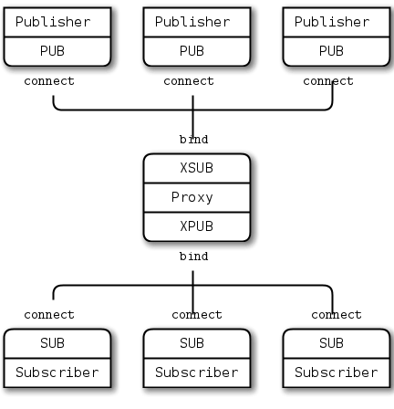

# ZeroMQ Programming with C++
ZeroMQ as a library works through sockets by following certain network communication patterns. It is designed to work asynchronously, and that’s where the MQ suffix to its name comes - from thread queuing messages before sending them.

## ZeroMQ Socket Types
ZeroMQ differs in the way its sockets work. Unlike the synchronous way the regular sockets work, ZeroMQ’s socket implementation “present an abstraction of an asynchronous message queue”.

The way these sockets work depend on the type of socket chosen. And flow of messages being sent depend on the chosen patterns, of which there are four:

- Request/Reply Pattern: Used for sending a request and receiving subsequent replies for each one sent.
- Publish/Subscribe Pattern: Used for distributing data from a single process (e.g. publisher) to multiple recipients (e.g. subscribers).
- Pipeline Pattern: Used for distributing data to connected nodes.
- Exclusive Pair Pattern: Used for connecting two peers together, forming a pair.

## ZeroMQ Transport Types
ZeroMQ offers four different types of transport for communication. These are:

- In-Process (INPROC): Local (in-process) communication transport.
- Inter-Process (IPC): Local (inter-process) communication transport.
- TCP: Unicast communication transport using TCP.
- PGM: Multicast communication transport using PGM.

## Structuring ZeroMQ Applications
ZeroMQ works differently than typical and traditional communication set ups. It can have either side of the link (i.e. either the server or the client) bind and wait for connections. Unlike standard sockets, ZeroMQ works by the notion of knowing that a connection might occur and hence, can wait for it perfectly well.

### Client - Server Structure
For structuring your client and server code, it would be for the best to decide and elect one that is more stable as the binding side and the other(s) as the connecting.

Example:
```
Server Application                           Client Application
---------------------[ < .. < .. < .. < .. ......................
Bound -> Port:8080                          Connects <- Port:8080
```

### Client - Proxy - Server Structure

To solve the problems caused by both ends of the communication being in a dynamic (hence unstable) state, ZeroMQ provides networking devices (i.e. utensils out of the box). These devices connect to two different ports and route the connections across.

* Streamer: A streamer device for pipelined parallel communications.
* Forwarder: A forwarding device for pub/sub communications.
* Queue: A forwarding device for request/reply communications.

Example:
```
   Server App.            Device | Forward           Client App.
  ............ > .. > . ]------------------[ < .. < .. .........
    Connects               2 Port Binding             Connects
```

## Programming Examples
Using our knowledge from the past section, we will now begin utilizing them to create simple applications.

1. Simple Messaging Using Request/Reply Pattern
2. Working with Publish/Subscribe Pattern
3. Pipelining the Pub./Sub. with Pipeline Pattern (Push/Pull)
4. Exclusive Pair Pattern
5. Usage Proxy Example

### 1. Simple Messaging Using Request/Reply Pattern
In terms of communicating between applications, the request/reply pattern probably forms the absolute classic and gives us a good chance to start with the fundamental basics of ZeroMQ.



Use-cases:
- For simple communications between a server and client(s).
- Checking information and requesting updates.
- Sending checks and updates to the server.
- Echo or ping/pong implementations.

Socket type(s) used:
- ZMQ_REP
- ZMQ_REQ

#### Server Example: server.cpp
Create a “server.cpp” using nano (nano server.cpp) and paste the below self-explanatory contents.

```cpp
#include <iostream>
#include <zmq.hpp>
#include <string>

std::string helloMsg = "Hello from server!";

int main(){

    zmq::context_t context(1);
    zmq::socket_t socket(context, ZMQ_REP);

    socket.bind("tcp://*:5555");
    std::cout << "[+] Server is running... tcp://*:5555" << std::endl;

    while(true){
        zmq::message_t message;
        socket.recv(&message);
        std::cout << "   Received message: " << message << std::endl;
        
        zmq::message_t reply(helloMsg.size());
        memcpy(reply.data(), helloMsg.c_str(), helloMsg.size());
        socket.send(reply);
        std::cout << "   Sending reply: " << helloMsg << std::endl;
    }
}
```

#### Client Example: client.cpp
Create a “client.cpp” using nano (nano client.cpp) and paste the below contents.

```cpp
#include <iostream>
#include <string>
#include <unistd.h>
#include <zmq.hpp>


std::string helloMsg = "Hello from client!";

int main() {

  zmq::context_t context(1);
  zmq::socket_t socket(context, ZMQ_REQ);

  socket.connect("tcp://localhost:5555");
  std::cout << "[+] Connecting to server... tcp://localhost:5555" << std::endl;

  while (true) {
    zmq::message_t request(helloMsg.size());
    memcpy(request.data(), helloMsg.c_str(), helloMsg.size());
    socket.send(request);
    std::cout << "    Sending message: " << helloMsg << std::endl;

    zmq::message_t reply;
    socket.recv(&reply); // Add this line
    std::cout << "    Received reply: " << std::string(static_cast<char*>(reply.data()), reply.size()) << std::endl;

    sleep(1);
  }
}
```

Note: When working with ZeroMQ library, remember that each thread used to send a message (i.e. .send(..)) expects a .recv(..) to follow. Failing to implement the pair will cause exceptions.


### 2. Working with Publish/Subscribe Pattern
In the case of publish/subscribe pattern, ZeroMQ is used to establish one or more subscribers, connecting to one or more publishers and receiving continuously what publisher sends (or seeds).

A choice to specify a prefix to accept only such messages beginning with it is available with this pattern.



Use-cases:

Publish/subscribe pattern is used for evenly distributing messages across various consumers. Automatic updates for scoreboards and news can be considered as possible areas to use this solution.

Socket type(s) used:
- ZMQ_PUB
- ZMQ_SUB

#### Publisher Example: server.cpp
Create a “server.cpp” using nano (nano server.cpp) and paste the below contents.

```cpp
#include <iostream>
#include <unistd.h>
#include <zmq.hpp>
#include <string>

std::string helloMsg = "Hello from server!";

int main(){

    zmq::context_t context(1);
    zmq::socket_t socket(context, ZMQ_PUB);

    socket.bind("tcp://*:5555");
    std::cout << "[+] Server is running... tcp://*:5555" << std::endl;

    auto id = 0;
    auto time = std::time(nullptr);

    while(true){
        sleep(1);
        id = id + 1;
        time = std::time(nullptr);

        // message format: <id> <time> <message>
        std::string message = std::to_string(id) + " " + std::to_string(time) + " " + helloMsg;
        zmq::message_t msg(message.size());
        memcpy(msg.data(), message.c_str(), message.size());
        socket.send(msg);

        std::cout << "   Sending message: " << message << std::endl;
    }
}
```

#### Subscriber Example: client.cpp
Create a “client.cpp” using nano (nano client.cpp) and paste the below contents.

```cpp
#include <iostream>
#include <unistd.h>
#include <zmq.hpp>
#include <string>

std::string helloMsg = "Hello from client!";

int main(){

    zmq::context_t context(1);
    zmq::socket_t socket(context, ZMQ_SUB);

    
    socket.connect("tcp://localhost:5555"); 
    std::cout << "[+] Client is running... tcp://localhost:5555" << std::endl;

    const char *filter = "";
    socket.setsockopt(ZMQ_SUBSCRIBE, filter, strlen(filter));

    while(true){
        zmq::message_t msg;
        socket.recv(&msg);

        std::string message = std::string(static_cast<char*>(msg.data()), msg.size());
        std::cout << "Received message: " << message << std::endl;
    }
}
```

Note: Using the .setsockopt(..) procedure, we are subscribing to receive messages starting with string 1. To receive all, leave it not set (i.e. "").


### 3. Pipelining the Pub./Sub. with Pipeline Pattern (Push/Pull)
Very similar in the way it looks to the Publish/Subscribe pattern, the third in line Pipeline pattern comes as a solution to a different kind of problem: distributing messages upon demand.



Use-cases:

Pipelining pattern can be used in cases where are list of queued items need to be routed (i.e. pushed in line) for the one asking for it (i.e. those who pull).

Socket type(s) used:
- ZMQ_PUSH
- ZMQ_PULL

#### PUSH Example: server.cpp
Create a “server.cpp” using nano (nano server.cpp) and paste the below contents.

```cpp
#include <iostream>
#include <unistd.h>
#include <zmq.hpp>
#include <string>

std::string helloMsg = "Hello from server!";

int main(){

    zmq::context_t context(1);
    zmq::socket_t socket(context, ZMQ_PUSH);

    socket.bind("tcp://*:5555");
    std::cout << "[+] Server is running... tcp://*:5555" << std::endl;

    auto id = 0;
    auto time = std::time(nullptr);

    while(true){
        sleep(1);
        id = id + 1;
        time = std::time(nullptr);

        // message format: <id> <time> <message>
        std::string message = std::to_string(id) + " " + std::to_string(time) + " " + helloMsg;
        zmq::message_t msg(message.size());
        memcpy(msg.data(), message.c_str(), message.size());
        socket.send(msg);

        std::cout << "   Sending message: " << message << std::endl;
    }
}
```

#### PULL Example: client.cpp
Create a “client.cpp” using nano (nano client.cpp) and paste the below contents.

```cpp
#include <iostream>
#include <unistd.h>
#include <zmq.hpp>
#include <string>

std::string helloMsg = "Hello from client!";

int main(){

    zmq::context_t context(1);
    zmq::socket_t socket(context, ZMQ_PULL);

    socket.connect("tcp://localhost:5555");
    std::cout << "[+] Client is running... tcp://localhost:5555" << std::endl;

    while(true){
        zmq::message_t request;
        socket.recv(&request);
        std::string message = std::string(static_cast<char*>(request.data()), request.size());
        std::cout << "   Received message: " << message << std::endl;
    }
}
```

The file worker_1.py will act as a task processes (consumer/worker).


### 4. Exclusive Pair Pattern
Exclusive pair pattern implies and allows establishing one-tone sort of communication channels using the zmq/PAIR socket type.



Socket type(s) used:
- ZMQ_PAIR

#### Bind Example: server.cpp
Create a “server.cpp” using nano (nano server.cpp) and paste the below contents.

```cpp
#include <iostream>
#include <unistd.h>
#include <zmq.hpp>
#include <string>

std::string helloMsg = "Hello from server!";

int main(){

    zmq::context_t context(1);
    zmq::socket_t socket(context, ZMQ_PAIR);

    socket.bind("tcp://*:5555");
    std::cout << "[+] Server is running... tcp://*:5555" << std::endl;

    auto id = 0;
    auto time = std::time(nullptr);

    while(true){
        sleep(1);
        id = id + 1;
        time = std::time(nullptr);

        // message format: <id> <time> <message>
        std::string message = std::to_string(id) + " " + std::to_string(time) + " " + helloMsg;
        zmq::message_t msg(message.size());
        memcpy(msg.data(), message.c_str(), message.size());
        socket.send(msg);

        std::cout << "   Sending message: " << message << std::endl;
    }
}
```

#### Connect Example: client.cpp
Create a “client.cpp” using nano (nano client.cpp) and paste the below contents.

```cpp
#include <iostream>
#include <unistd.h>
#include <zmq.hpp>
#include <string>

std::string helloMsg = "Hello from client!";

int main(){

    zmq::context_t context(1);
    zmq::socket_t socket(context, ZMQ_PAIR);

    socket.connect("tcp://localhost:5555");
    std::cout << "[+] Client is running... tcp://localhost:5555" << std::endl;

    while(true){
        zmq::message_t request;
        socket.recv(&request);
        std::string message = std::string(static_cast<char*>(request.data()), request.size());
        std::cout << "   Received message: " << message << std::endl;
    }
}
```

Usage
You can use the above example to create any bidirectional uni-connection communication applications.

### 5. Usage Proxy Example



Socket type(s) used:
- ZMQ_PUB
- ZMQ_XPUB
- ZMQ_XSUB
- ZMQ_SUB

#### Publisher (publisher.cpp )

```cpp
#include <iostream>
#include <unistd.h>
#include <zmq.hpp>
#include <string>

std::string helloMsg = "Hello from producer!";

#define XPUB_ENDPOINT "tcp://localhost:9200"
#define XSUB_ENDPOINT "tcp://localhost:9210"


int main(){

    zmq::context_t context(1);
    zmq::socket_t socket(context, ZMQ_PUB);

    socket.connect(XSUB_ENDPOINT);
    std::cout << "[+] Producer is running... " << XSUB_ENDPOINT << std::endl;

    while(true){
        zmq::message_t message(helloMsg.size());
        memcpy(message.data(), helloMsg.c_str(), helloMsg.size());
        socket.send(message);
        std::cout << "   Sending message: " << helloMsg << std::endl;
        sleep(1);
    }
}
```

#### Proxy (proxy.cpp)

```cpp
#include <iostream>
#include <zmq.hpp>
#include <string>

std::string helloMsg = "Hello from proxy!";

int main(){

    zmq::context_t context(1);
    zmq::socket_t frontend(context, ZMQ_XPUB);  

    frontend.bind("tcp://*:9200");
    std::cout << "[+] Proxy is connection to producer... tcp://*:9200" << std::endl;

    zmq::socket_t backend(context, ZMQ_XSUB);
    backend.bind("tcp://*:9210");
    std::cout << "[+] Proxy is connection to subscriber... tcp://*:9210" << std::endl;

    zmq::proxy(frontend, backend, nullptr);

    return 0;
}
```

#### Subscriber (subscriber.cpp)


```cpp
#include <iostream>
#include <zmq.hpp>
#include <string>

std::string helloMsg = "Hello from subscriber!";

int main(){

    zmq::context_t context(1);
    zmq::socket_t socket(context, ZMQ_SUB);

    socket.connect("tcp://localhost:9200");
    const char *filter = "";
    socket.setsockopt(ZMQ_SUBSCRIBE, filter, strlen(filter));
    std::cout << "[+] Subscriber is running... " << std::endl;

    while(true){
        zmq::message_t message;
        socket.recv(&message);
        std::string msg = std::string(static_cast<char*>(message.data()), message.size());
        std::cout << "   Received message: " << msg << std::endl;
    }
}
```